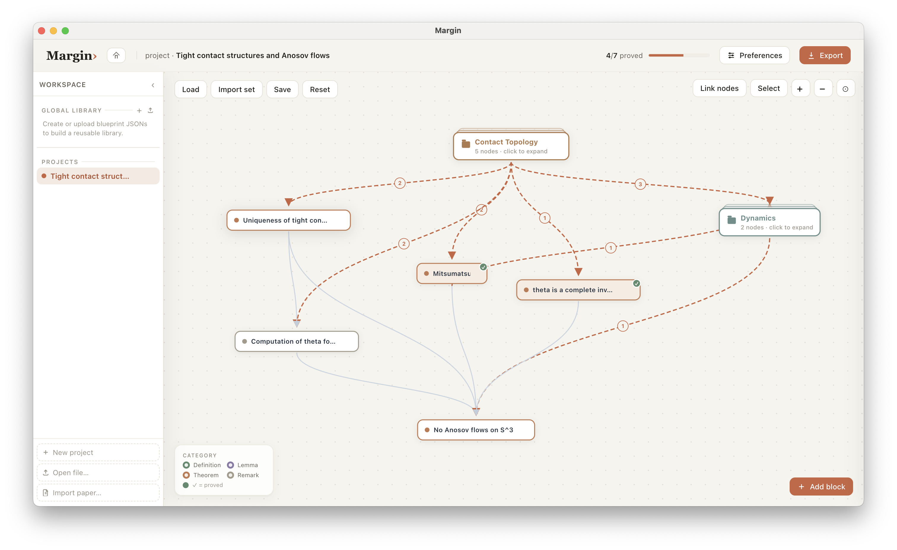

# Margin

Margin is a macOS desktop application for mathematicians that organizes mathematical knowledge as a dependency graph. Just as the structure of a proof can be understood as a directed acyclic graph — definitions grounding lemmas, lemmas supporting theorems — Margin makes that structure explicit and navigable. Its goal is to provide a faithful, visual representation of the dependency relations in a body of mathematics, with AI assistance for both construction and exploration.

Write definitions, lemmas, theorems, and remarks; connect them with dependency edges; and Margin automatically determines which results are fully proved.

> **Requires macOS on Apple Silicon (M1 or later).**

---

## Screenshots


*Home dashboard — activity calendar, quick-create cards, and per-project statistics.*


*Dependency graph for an imported paper, automatically extracted from a PDF by AI.*

---

## Download

Grab the latest DMG from the [Releases](https://github.com/ypan-code-usc/margin/releases) page, open it, and drag **Margin.app** to `/Applications`.

> **"Cannot be opened" error?** Because Margin is not yet notarized with Apple, macOS Gatekeeper may block the first launch. Run this once in Terminal, then double-click to open normally:
> ```bash
> xattr -cr /Applications/Margin.app
> ```

---

## Features

- **Dependency graph** — layered auto-layout with pan, zoom, and drag to reposition nodes.
- **Proof status** — a node is *proved* once all its dependencies are proved and a proof is written; status propagates automatically.
- **Edit modal** — edit kind, title, statement, proof, and dependencies with live KaTeX preview.
- **AI proof chat** — per-node chat panel backed by Claude, OpenAI, or Gemini.
- **Proof Architect** — AI decomposes a written proof into new dependency nodes.
- **Import from paper** — upload a PDF or paste LaTeX/plain text; Claude extracts all mathematical objects and their dependencies into a new project.
- **⌘K search** — fuzzy search across all nodes by title or statement.
- **Knowledge sets** — nested, collapsible groups of nodes; drag to reposition or nest.
- **Multi-project workspace** — create, rename, delete, and switch between projects; all data autosaves locally.
- **Home dashboard** — activity calendar, project cards with stats and mini graph previews.
- **LaTeX export** — generates a `.tex` file with leanblueprint-compatible environments.
- **Global library** — upload blueprint JSONs and drag them onto any project canvas.

---

## Building from source

**Requirements:** macOS, [Node.js](https://nodejs.org) ≥ 18, Apple Silicon.

```bash
git clone https://github.com/ypan-code-usc/margin.git
cd margin
npm install
npm run build
```

The finished disk image is written to `dist/Margin-1.0.0-arm64.dmg`. Open it, drag **Margin.app** to `/Applications`, and launch.

> **Intel Mac:** replace the `electron` package with an x64 build and re-run `npm run build`. The app sources are platform-neutral; only the Electron binary differs.

### What the build does

`build.sh` (run by `npm run build`):

1. Refreshes `vendor/katex/` and `vendor/pdfjs/` from `node_modules`.
2. Copies the Electron shell into `dist-app/Margin.app` and injects the app sources.
3. Renames the bundle from *Electron* to *Margin*.
4. Packages the `.app` into a compressed DMG with `hdiutil`.

### Running without building

```bash
npm start   # launches Margin in development mode (Electron)
```

You can also open `index.html` directly in a browser — everything works except dragging sets from the global library.

---

## AI integration

Set your API key in **Preferences → AI Integration**. Keys are stored locally and never transmitted except to the chosen provider.

| Provider | Models |
|---|---|
| Anthropic Claude | claude-opus-4-8, claude-sonnet-4-6, claude-haiku-4-5 |
| OpenAI | gpt-4o, gpt-4o-mini |
| Google Gemini | gemini-2.5-pro, gemini-2.5-flash, gemini-2.0-flash |

---

## Blueprint JSON format

Projects can be saved and loaded as `blueprint.json`:

```json
{
  "project": { "title": "My Project" },
  "nodes": [
    {
      "id": "def:foo",
      "kind": "definition",
      "title": "Foo",
      "statement": "A <i>foo</i> is …",
      "uses": [],
      "proof": null
    },
    {
      "id": "lem:bar",
      "kind": "lemma",
      "title": "Bar lemma",
      "statement": "Every foo satisfies …",
      "uses": ["def:foo"],
      "proof": { "uses": ["def:foo"], "text": "Follows from the definition." }
    }
  ]
}
```

`proof` is `null` for definitions. `uses` lists dependency IDs. A node is proved when all its dependencies are proved and `proof.text` is non-empty.

---

## License

MIT — see [LICENSE](LICENSE).
